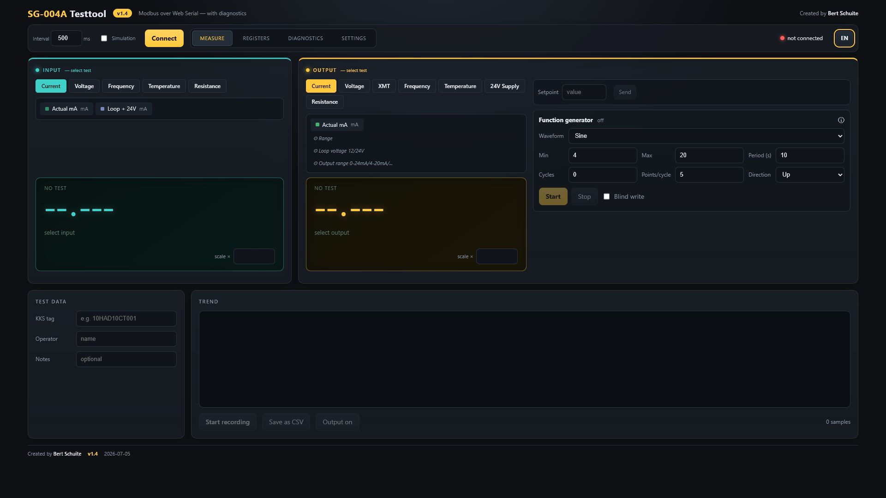

# SG-004A Test Tool

A browser-based Modbus test tool for the **FNIRSI SG-004A**, created by Bert Schuite.

The application communicates directly with the SG-004A through the Web Serial API. No installation or separate server is required.

Keywords: SG-004A, FNIRSI SG-004A, signal generator, function generator, signal calibrator, process calibrator, Modbus, Web Serial, 4-20 mA, 4-20mA, 0-10 V, 0-10V, current loop, voltage input, voltage output, tester, diagnostics and CSV logging.

## Live application

[Open the SG-004A Test Tool](https://Bsc1967.github.io/sg004a-testtool/)

## Features

- Measure input and output values
- Automatically detect the configured input and output channels
- Set and retain output setpoints
- Function generator with sine, triangle, sawtooth, square, ramp and staircase waveforms
- Communication-aware period and points-per-cycle control
- Trend display and CSV recording
- Register overview and serial diagnostics
- English and Dutch user interface
- Simulation mode for use without connected hardware
- Responsive widescreen layout

## Browser requirements

Use a current desktop version of:

- Google Chrome
- Microsoft Edge

Firefox and Safari do not currently support the Web Serial API. The browser always asks the user for permission before granting access to a serial port.

## Using the test tool

1. Connect the SG-004A to the computer through USB.
2. Open the [live application](https://Bsc1967.github.io/sg004a-testtool/) in Chrome or Edge.
3. Click **Connect**.
4. Select the serial port belonging to the SG-004A.
5. Verify the detected input type, output type and output setpoint.
6. Select the required measurement or function-generator settings.

## Running locally

Download `index.html` and open it in Chrome or Edge. Browser security policies may differ when opening a local file, so using the published HTTPS version is recommended.

## Publishing with GitHub Pages

1. Create a public GitHub repository named `sg004a-testtool` under the `Bsc1967` account.
2. Upload all files from this directory to the repository's `main` branch.
3. Open the repository's **Settings → Pages** section.
4. Under **Build and deployment**, select **Deploy from a branch**.
5. Select the `main` branch and the `/root` directory.
6. Save the configuration and wait for GitHub Pages to finish deployment.

The application will then be available at:

`https://Bsc1967.github.io/sg004a-testtool/`

## Safety notice

Always verify the selected signal type, output range and wiring before enabling an output. The user remains responsible for the connected equipment and all generated output values.

## Privacy

The application runs entirely in the browser. It does not upload serial communication, measurements or CSV recordings to a server.

## License

This project is available under the [MIT License](LICENSE).
